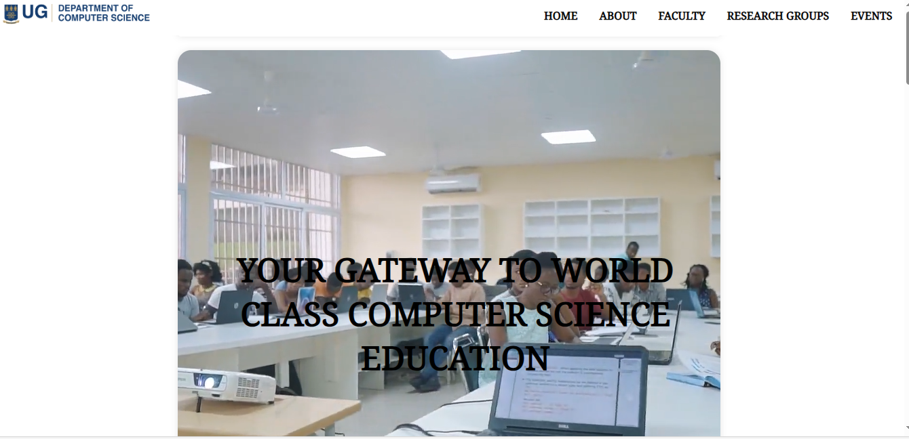
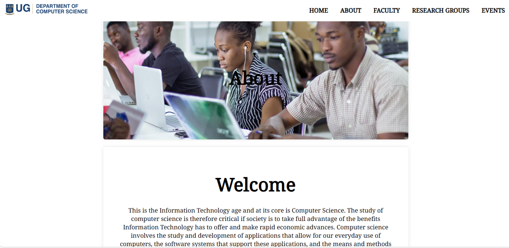
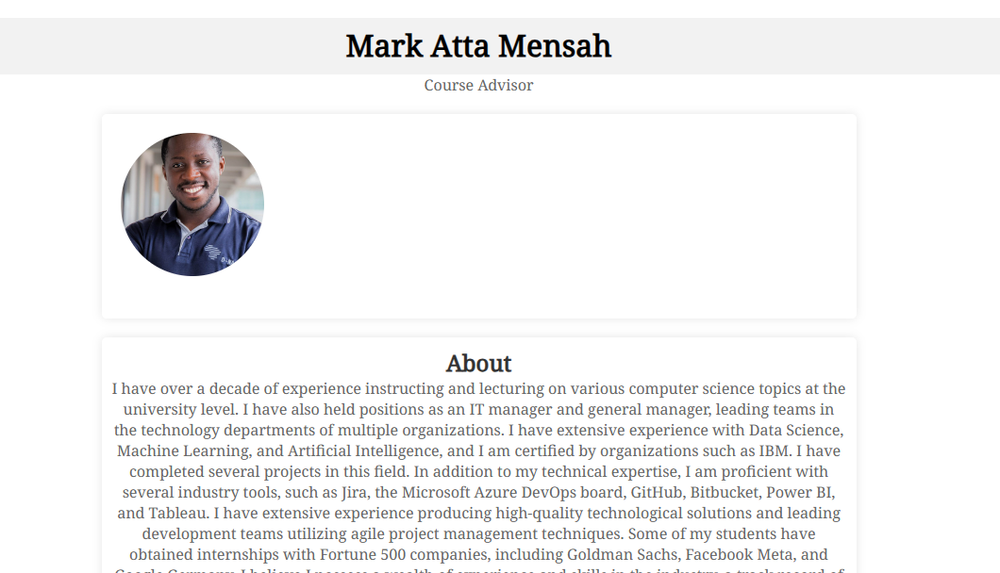
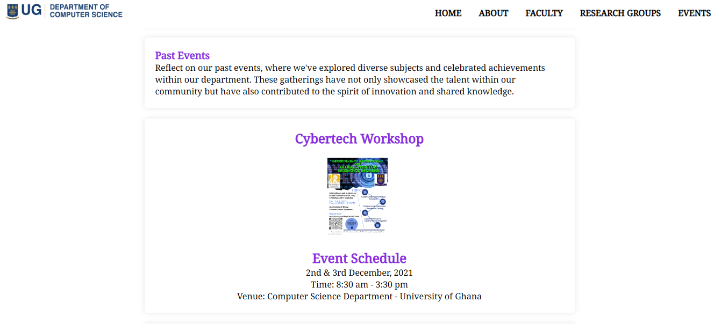
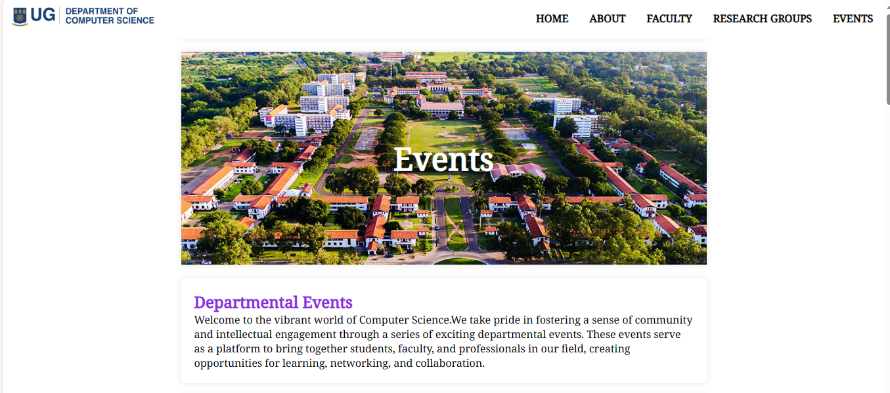

# DCIT_205_IA

# Computer Science Department Project

Welcome to the Computer Science Department Website project! The aim of this initiative is to establish an online presence for our department, offering a centralized hub for information, resources, and communication. The website will serve as a vital tool for students, faculty, prospective students, and anyone interested in our department's activities.

## Table of Contents

- [Project Overview](#project-overview)
- [Technologies Used](#technologies-used)
- [Features](#features)
- [Installation and Setup](#installation-and-setup)
- [Usage](#usage)
- [Contributing](#contributing)
- [License](#license)

## Project Overview

Provide a brief overview of your project. Explain its main purpose, significance, and any goals or challenges it addresses.

## Technologies Used

List the key technologies, programming languages, or frameworks used in your project.

- Frontend:
  HTML, CSS

## Features

Highlight the main features or functionalities of your project.

- Feature 1: Description
- Feature 2: Description
- ...

## Screenshots

### Homepage

### About

### Faculty

### Events

## What I've Learnt

